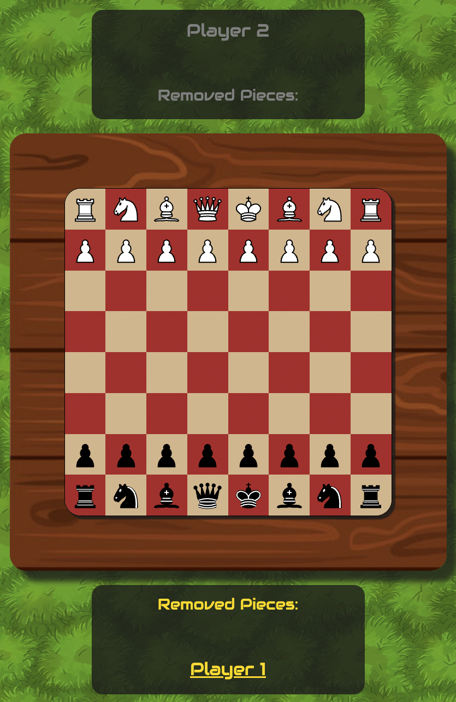
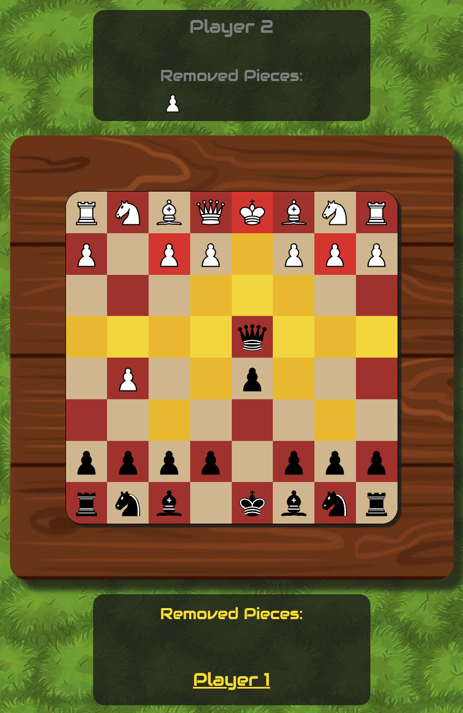
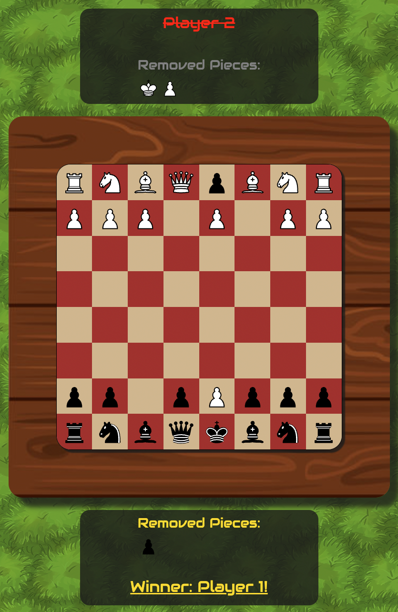

# Chess

    This project is a re-creation of the popular board game, chess. This web app must be played with two people.

# Screenshots

 
    When it is a player's turn, the text in their section will be highlighted yellow, while the other player's text will be grayed out. For example, in the screenshot below Player 1's side is highlighted yellow, therefore it is Player 1's turn. 

 
    Upon clicking on a piece, the available moves for that piece will light up on the board. Yellow indicates an available move to an empty position, whereas red indicates an available move on an enemy piece. In the example below, Player 2's queen is selected and all of its available moves are shown in yellow and red. 

    Finally, once the opposing King has been removed from play, the winner will be announced as indicated by the updated text. The loser's side will be striked out and in red text.

# Technologies Used 

    Technology used to build this game include HTML, CSS, JavaScript, and Bootstrap CSS. 

# Getting Started

    <b>Link to the game:</b> https://erictau.github.io/chess/

## Instructions

### Chess Rules

    Aside from the rules for check and checkmate, this game implements the standard rules of chess. If unfamiliar with the rules, please see the following link: https://www.chess.com/learn-how-to-play-chess

### Two Players

    To play the game, two players must share a device and alternate turns. There is no single player mode.

### Selecting and Moving Pieces

    First, Player 1 must select one of its pieces. Once selected, all available moves for this specific piece will be highlighted. To move the selected piece, click on the highlighted cell you wish to move your piece to. Alternatively, if you would like to de-select the piece, simply re-click on the same piece before selecting another piece. 

    A player is unable to select a piece that does not belong to them. A player is also unable to select a piece they own that has no available moves. 

    Note: When a pawn is eligible for promotion, a set of buttons will appear on the screen for the player to respond to. The game will not allow either player to make a move until the player whose pawn is eligible for promotion clicks one of the buttons. 

### Win Conditions

    A game is over when either players' king piece is removed from the board. Upon victory, the winner's name will be highlighted and the board pieces can no longer be selected for further moves. 

### Restarting the Game

    The restart game button feature is in development. To restart, manually refresh the page. 

# Next Steps

## Icebox Items
<ul>
    <li>Mobile Responsiveness</li>
    <li>Restart Button</li>
    <li>Score Tracker</li>
    <li>Timer to Limit Player Turn Length</li>
    <li>Check and Checkmate Rules</li>
</ul>